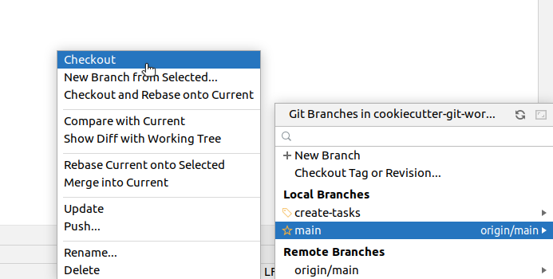
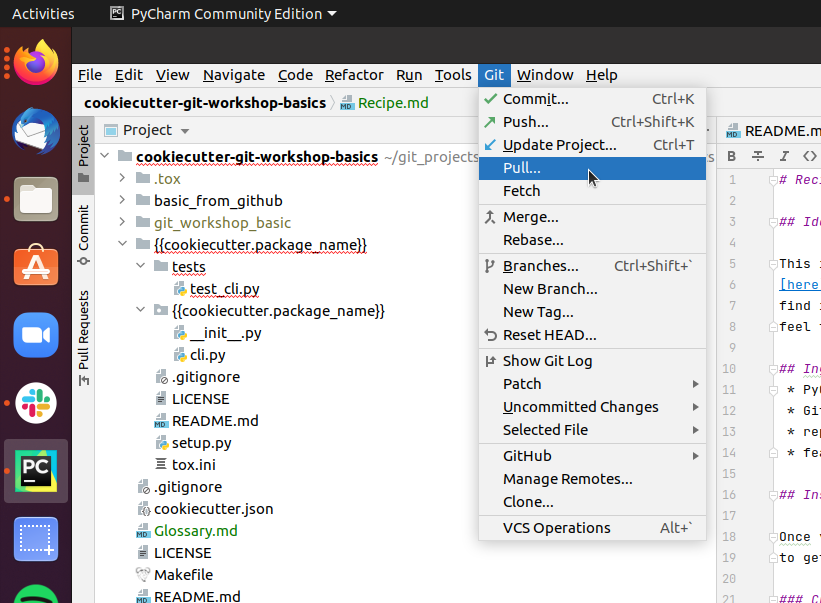
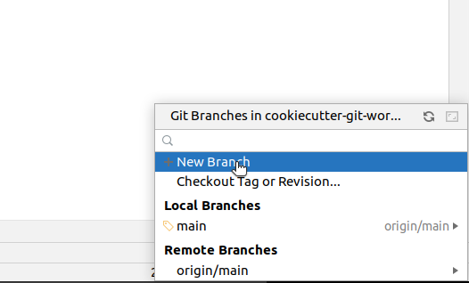
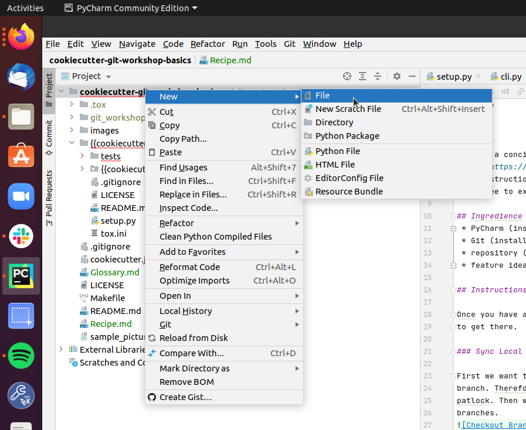
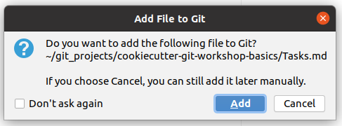
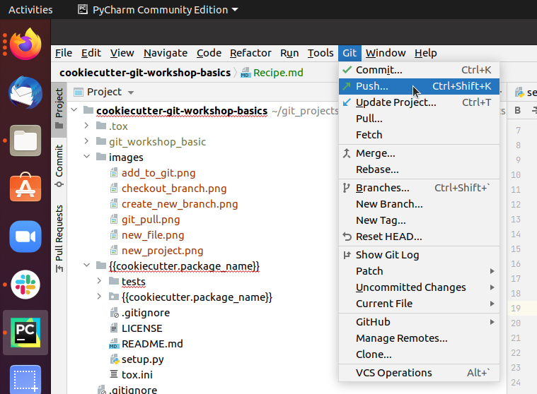

# Recipe

## Idea

This is a concise manual to a basic GIT-workflow. You can find more details
[here](https://guides.github.com/introduction/flow/). For each step you can 
find instructions how to do it using PyCharm. There is different ways to do it,
feel free to explore them on your own.

## Ingredience
 * PyCharm (installed)
 * Git (installed)
 * repository (to be changed)
 * feature idea

## Instructions

Once you have an idea what you want to achieve the following steps will help you
to get there.

1. [Update Local](#1-sync-local)
2. [Create Branch](#2-create-branch)
3. [Add Commits](#3-add-commits)
4. [Push Branch](#4-push-branch)
5. [Merge Request](#5-merge-request)
6. [Discussion](#6-discussion)
7. [Merge Branch](#7-merge-branch)

### 1. Sync Local

First we want to make sure to use the newest version of the repositories main
branch. Therefore we click on the button in the bottom right corner next to the
patlock. Then we see a context menue like this that displays all the local 
branches.

Click on the main/master branch and choose "Checkout" in the second context 
menue to switch to the main/master branch.
Now we need to make sure that your local main/master branch is up to date with
the upstream main/master. Therefore we pull the newest state from upstream. In 
the upper left corner we can find the menue bar, click on "Git" and choose pull
in the pull down menue.

### 2. Create Branch

Now we create a branch to implement our feature. In order to do so move your 
cursor to the buttom right corner and click on your current branch name, 
which should be main/master, next to the patlock.

Within the context menue click on "New Branch" and enter a branch name that
relates to your feature idea.

### 3. Add Commits

Now you need to add, change or delete some content in the repository to achieve
your goal. For instance you want to add a new file "Tasks.md". Then you make a
right click onto the folder that should contain your new file.

In the context menue select "new" and "File" and enter the filename in the 
consecutive prompt. Then PyCharm wants to know if Git should look after your
new file.

Normally that is a good idea and you shall choose "Add".

### 4. Push Branch

Now you want to push the branch with your changes to the upstream server. This
way you create an identical copy of your local branch on the server. To do so

go to the upper left corner where you can find the menue bar and click on `Git`
and choose `push` in the pull down menue.

### 5. Merge Request
Now that you pushed your local branch to the upstream server, you want to create
a merge request on the server. Therefore open your browser and go to 
`https://git.tu-berlin.de/your_name/your_project/`. On the left hand side you
click on `Merge Requests`. Then you get to a page that looks like this:

Here click on `Create merge request` to create a request to merge `your_branch`
(here: "basic_description") into main/master. Then you can add a description

and assign a reviewer. Finally submit you merge request.

### 6. Discussion

Now the reviewer of the merge request checks your changes and gives you
feedback. After some discussion you might want to go back to step 3 and add 
additional commits to change the current state. For the sake of practising 
some interations in the workshop, you can just approve your own merge requests
and continue.

### 7. Merge Branch

When all discussions are done and you are sure that your changes improve the
main/master branch, it is time to merge your branch by

clicking on `Merge`. 

Now master on the upstream server is newer than your local branch and its time
to start all over again ([step 1](#local)).

