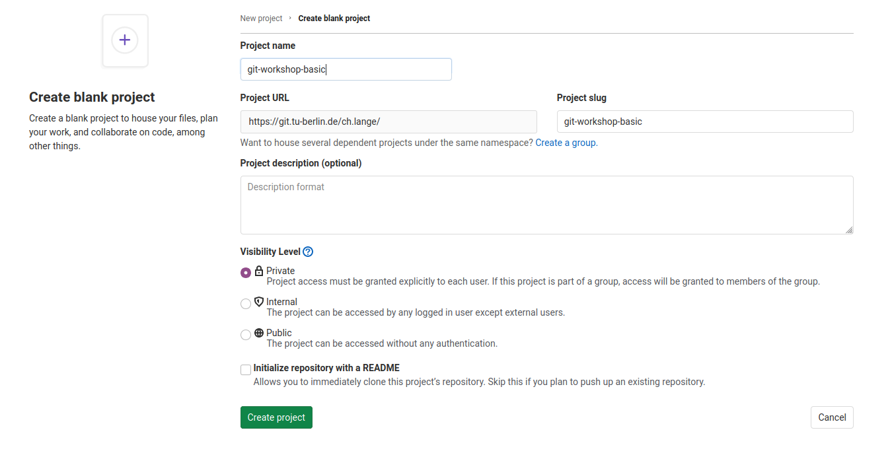

# Tasks

This file contains all tasks that will help you to practise what you learned
about Git. To get most out of the workshop please try to solve these tasks and
do not hesitate to ask the instructor for help.

## Task 1: Create a repo

First of all you want to create a repository on GitLab/GitHub. Therefore go to
the URL of your GitLab Server, i.e. 
[https://git.tu-berlin.de](https://git.tu-berlin.de/). Then you click on 
`New Project` and select `Create blank project`. Then you may choose a
name for your repository 

and click `Create project`.

