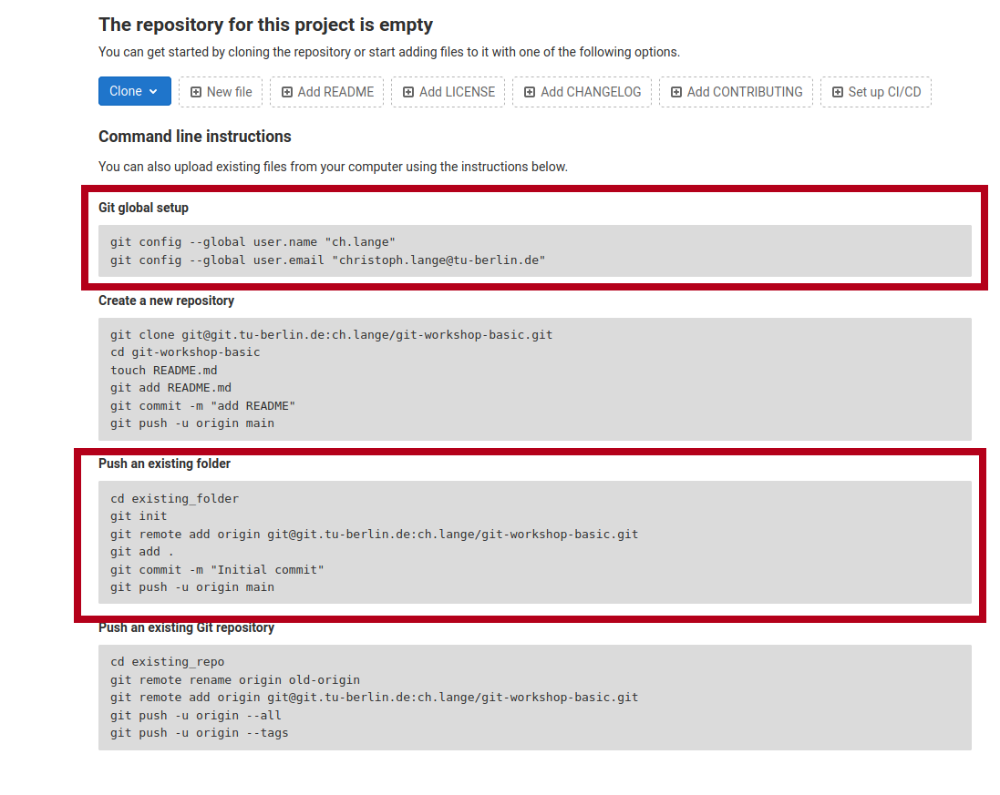

# Tasks

This file contains all tasks that will help you to practise what you learned
about Git. To get most out of the workshop please try to solve these tasks and
do not hesitate to ask the instructor for help.

Before starting with the tasks make sure that you did your 
[setup](README.md#Setup) properly.

## Task 1: Create a repo

### Create Project on GitLab
First of all you want to create a repository on GitLab/GitHub. Therefore, go to
the URL of your GitLab Server, i.e. 
[https://git.tu-berlin.de](https://git.tu-berlin.de/). Then you click on 
`New Project` and select `Create blank project`. Then you may choose a
name for your repository 

and click `Create project`.

### Use Project Template
Now we created an empty project that we want to fill with an example package
that can do some basic image operations. 
Therefore we do the following steps:

1. Open a terminal

2. Install the python package cookiecutter
    ```shell
    pip3 install cookiecutter
    ```

3. Use `cd` to navigate to the directory that you want to start a repository.

4. Create your python package with 
    ```shell
    cookiecutter https://github.com/spirousschuh/cookiecutter-git-workshop-basics
    ```
   Now you will see 
   ```shell
   author_name [Josephine Doe]: 
   ```
   This requires your input now. You can either press `Enter`, then the 
   author_name will be Josephine Doe. Or you can enter your own name.

5. Answer the questions that will be prompted to you or press `Enter` to choose
   the default value. You do not need to reveal
   your real data, as it is a toy project anyway. But you could choose answers
   like these:
   
   Pay attention at the third question. The answer to that question will be
   the name of the folder where you can find your package later.
   
6. Make sure that the folder exists by entering the folder.
   ```shell
   cd my_image_package
   ```
   The name of the folder corresponds to your answer to the question
   `package_name [git_workshop_basic]:`.

7. Go back to your browser and open 
   [https://git.tu-berlin.de](https://git.tu-berlin.de). Then go to the project
   that you just created in the [last section](#create-project-on-gitlab). As it
   is an empty project the landing page should look like this:
   
8. Follow the step that are displayed under `Git global setup` (first red box)
   one by one, i.e.    you copy each line to your terminal and press `Enter`.
9. Follow the steps you find in the section `Push an existing folder` 
   (second red box). You need to replace `cd existing_folder` with the package
   name that you chose in step 5. In case you forgot the package name you can 
   check it with `ls -l` which displays the content of the current directory.
   (if you get an error like `error: src refspec main does not match any` you 
   need to replace main with master)
10. Go to your project webpage `https://git.tu-berlin.de/your_name/your_project`.
   When you see a basic README.md file you succeeded.


## Task 2: Improve the Readme

Now we will get to know our package a bit better and try to write down what we
find. 
1. Go to the package root folder which contains the README.md.
   ```shell
   cd /path/to/your_package
   ```
2. Install your package in editable mode (your changes are regonized)
   ```shell
   pip install -e .
   ```
3. Finally we are done with doing dark magic on the command line. So please
   start PyCharm and open `your_project`.
4. Use the basic git workflow described in the [Recipe.md](Recipe.md) file to 
   edit the README.md.
   
5. Once you are done, follow the workflow all the way and merge the feature
   branch into main/master
   
## Task 3: Create a Thumbnail

1. Try to use the functionality already implemented in the package
   ```shell
   image_magic --help
   ```
2. Try to create a thumbnail with a picture of your choice.
   ```shell
   image_magic thumbnail --input-path=sample_picture.jpg --output-path=/some/other/path
   ```
3. Use the basic git workflow described in the [Recipe.md](Recipe.md) file to 
   edit the README.md. In the README.md you want to create a description of how 
   to create a thumbnail over command line.

4. Once you are done, follow the workflow all the way and merge the feature
   branch into main/master
   
## Task 4: Change thumbnail size

Now we will do the first code change. From now on you should always use the
git workflow described in [Recipe.md](Recipe.md). 

1. Try to find the code that creates the thumbnail.
2. Change the code so that the size of the thumbnail is different to 
   $128 \times 128$ pixels.
3. Test that your code change works.
4. Merge your feature branch

## Task 5: Change direction of rotation

1. Find the code that rotates the image.
2. Document that functionality in the README.md
3. Make a seperate commit for the documentation
4. Now you should change the direction of rotation. Currently the direction is
   counter-clockwise, it should be clockwise.
5. Merge your feature branch   

## Task 6 (optional): Color to Black and White

This task is more complex. You might want to do some internet research.

1. Add a new subcommand to the command line interface.
   ```shell
   image-magic color_to_bw --input-path=/path/color.jpg --output-path=/path/bw.jpg
   ```
2. Document this feature in a seperate commit
3. Merge your feature branch